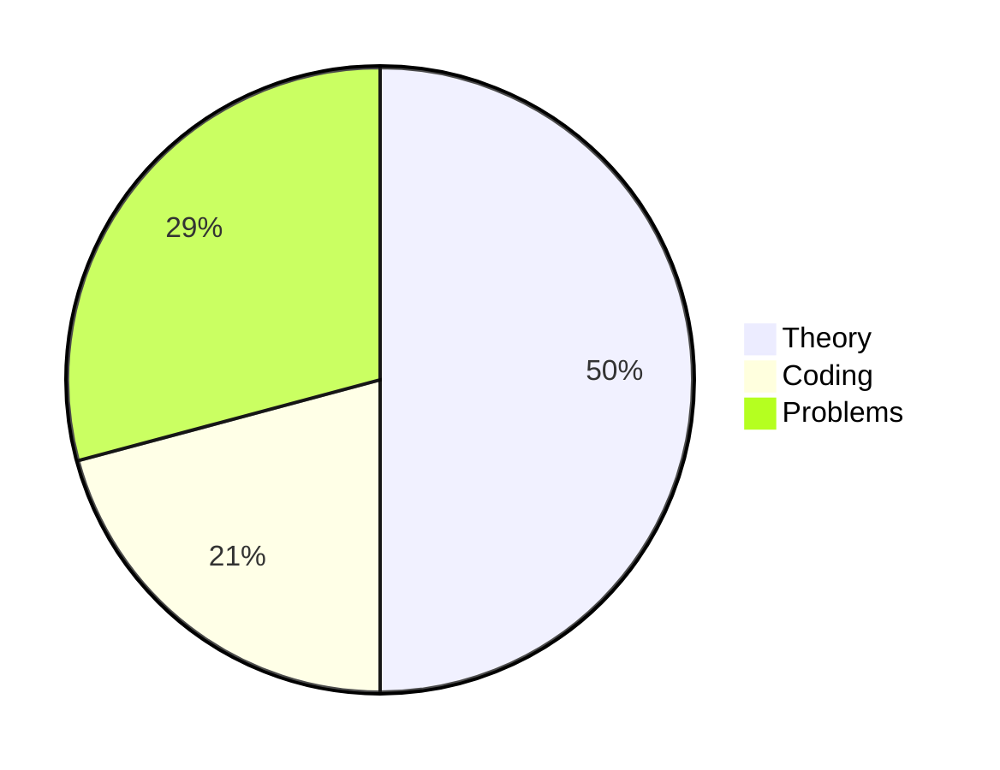
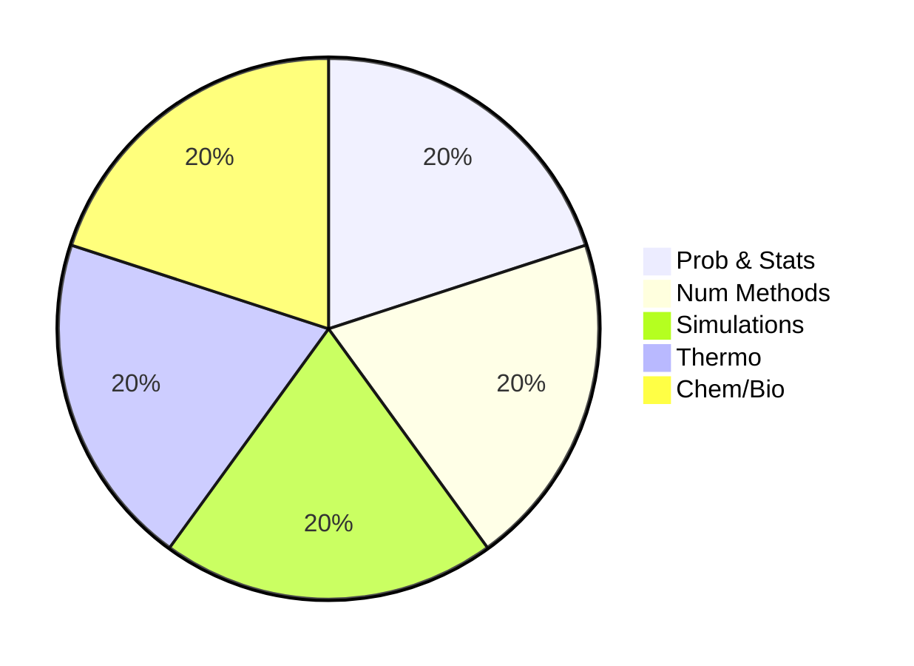

<!-- slide -->
## Intro to Stat Mech (Chem 563)


<!-- slide -->
### Course logistics
 - **Communication:**
Canvas-discussion or Slack-chat! Let's ditch formal emails :)
 <br>
 - **Resources:**
    1. Slides.
    2. Handwritten notes.
    3. Jupyter notebooks.
<br>


<!-- slide -->
### Computational aspects
Just need a working laptop to access HPC!
  - **Language:** Python3.7
  - **Simple toy simulations:** build with from scratch with python3/numpy/scipy
  - **Stat Modeling:** PyMC, Seaborn, Statsmodels
  - **MD Simulations:** OpenMM and HOOMD


<!-- slide -->
## Why study Stat Mech?

**Theoretical foundation of complex systems**
  - How to describe many-body systems?
  - Life is inherently unpredictable and complex.
  - Probabilistic logic is the only sensible logic to use.
  - Better to call statistical physics or science of complexity.

**Applications to physics/chemistry/biology:**
  - Deeper understanding of Thermodynamics and Kinetic
  - Simulations!
  - Data Analysis!
  - AI, Inference and Machine Learning!


<!-- slide -->
## Equations for a lifetime!

1. Entropy! Boltzman & Shannon intepretations.
 $$
\boxed{S=\sum_i p_i log p_i \,\,\,\,\,\, S=k_B logW}
 $$


2. Boltzmann distribution!
$$
\boxed{p_i \sim e^{-E_i/k_B T}}
$$


3. Partition function and Free energy!

$$
\boxed{Z=\sum_i e^{-E_i/k_B T} \,\,\,\,\,\, F=-k_B T log Z}
$$

4. Ideas from probability theory: large deviation, central limit.  
$$
\boxed{p_N(z)\sim e^{-NI(z)} \,\,\,\,\,\,\ p_N(z)\sim e^{-z^2}}
$$

5. Ising model of phase transitions!
$$
\boxed{H=-J s_i s_j +h s_i}
$$

<!-- slide -->
### HW, Exam and final presentation/project.

- HW Every week.
- At the end of the class pick a presentation.


<!-- slide -->
### Format of the lectures
- Run simulations on HPC-class cluster (mostly CPUs)
- Book + supplementary pdf papers+ Lecture notebooks
- Complete HW in jupyter/markdown/latex and easily submit online


<!-- slide -->
## Learning Paths

- Read the book, look up papers for understanding the reasons of what we do.
- Practice python coding on motivating scientific examples.
- Computational tutorials and blogs.
- Github, Gitlab and BitBucket!
- Ask questions, bring new ideas and educate us!

<!-- slide -->
### Pie Charts for the class





<!-- slide -->
### Logging into HPC

```bash
ssh yourname@hpc-class.iastate.edu
cd /shared/class/chem563
source activate chem563 # our special environment
```

<!-- slide -->
### Jupyter Hub

Learn more about jupyter projects from these links:

- JupyterLab
- JupyterNotebook
- JupyterHub


<!-- slide -->
### Manage your environments with conda


```python
# Creating an environment named myenv
conda create --name myenv
#Create with specific python version and packages
conda create -n myenv python=3.7 scipy matplotlib numpy
```

```python
#Create from a file
conda env create -f environment.yml   
#Make a clone of an environment
conda create --name myclone --clone myenv
```

```python
conda env list # list all environments
conda remove --name myenv --all #create environment from a file
```

> Find more about **conda** environment management from [here](https://docs.conda.io/projects/conda/en/latest/user-guide/tasks/manage-environments.html)

> Find more about alternative environment management option **pipenv** here.
